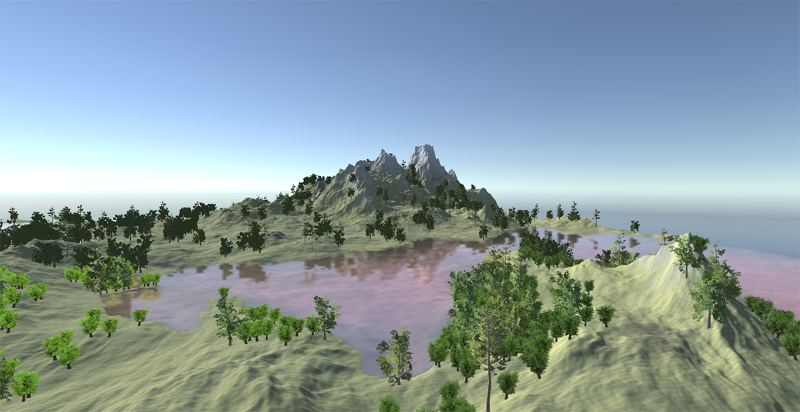

# Experiment in terrain generation and weather simulation

#### Acknowledgement
Air dynamics are inspired by a 2D version, described in [GPU Gems](http://developer.download.nvidia.com/books/HTML/gpugems/gpugems_ch38.html)  
Terrain textures are from [Surfaces Lite](https://assetstore.unity.com/packages/2d/textures-materials/surfaces-lite-89739) and [QS Materials Nature](https://assetstore.unity.com/packages/2d/textures-materials/qs-materials-nature-pack-grass-vol-2-32020)  
Trees and grass are from [Free SpeedTrees](https://assetstore.unity.com/packages/3d/vegetation/speedtree/free-speedtrees-package-29170) and [Nature Starter Kit 2](https://assetstore.unity.com/packages/3d/environments/nature-starter-kit-2-52977)  

#### Usage
You'll need CUDA and some python packages  
```cmd
pip install grpcio pycuda ipyvolume scikit-video visdom
```

##### Terrain generation
1. Make sure your environment contains paths to C++ compiler, required by CUDA, e.g. by running something like
```cmd
"C:\Program Files (x86)\Microsoft Visual Studio 14.0\VC\vcvarsall.bat" x64
```
2. Start generation server
```cmd
python gen.py
```
3. In Unity, select `BraveGen -> Generate terrain` from the top menu  

_The random seed is fixed to 0 in `terrain_base.cu::make_noise()`_

  

##### Weather simulation
_dynamics are still quite bad - humid air won't fly far enough into the land_

You can find simulation code in `gen.ipynb`, after the running the cell with simulation, the 2D frames will be sent to `visdom` and the 3D ones will saved to `sim_data.dat`. You can view 3D frames by enabling the `Simulation` object in Unity.

Simulation view in Unity  
  

In [visdom](https://github.com/facebookresearch/visdom)  


#### Help
* After rebuilding .proto, recent Python gRPC compiler seems to have changed service name generation scheme, but Unity gRPC plugin has not, so you'll need to fix the _WorldGenGrpc.cs_ by changing "worldgen.WorldGen" to "WorldGen"
